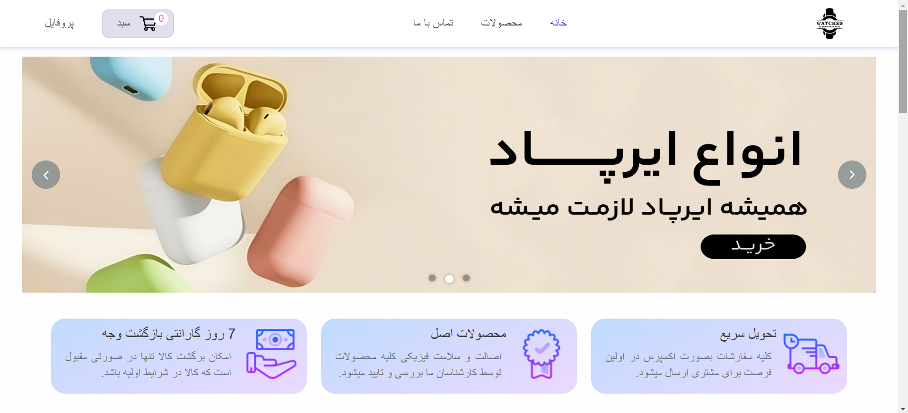
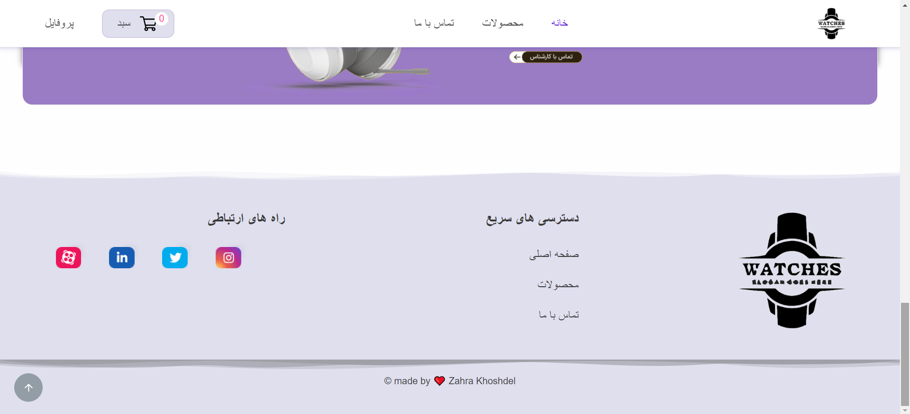
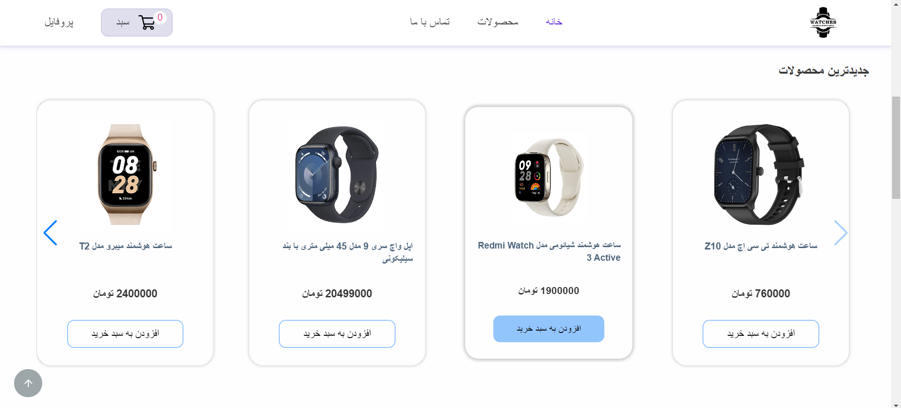
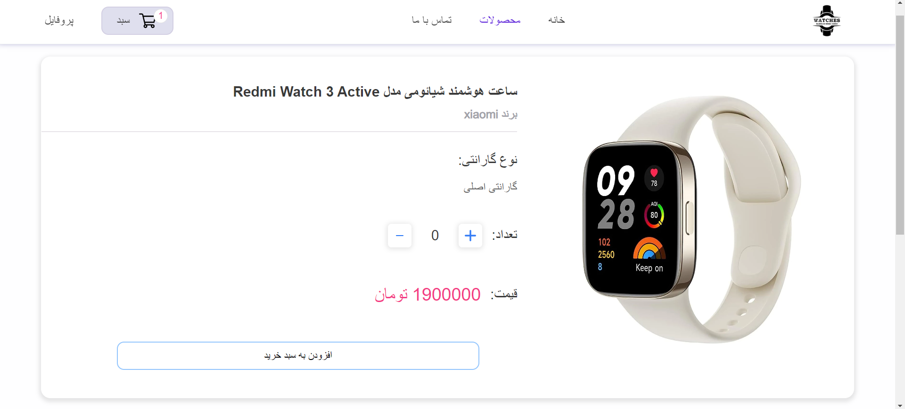
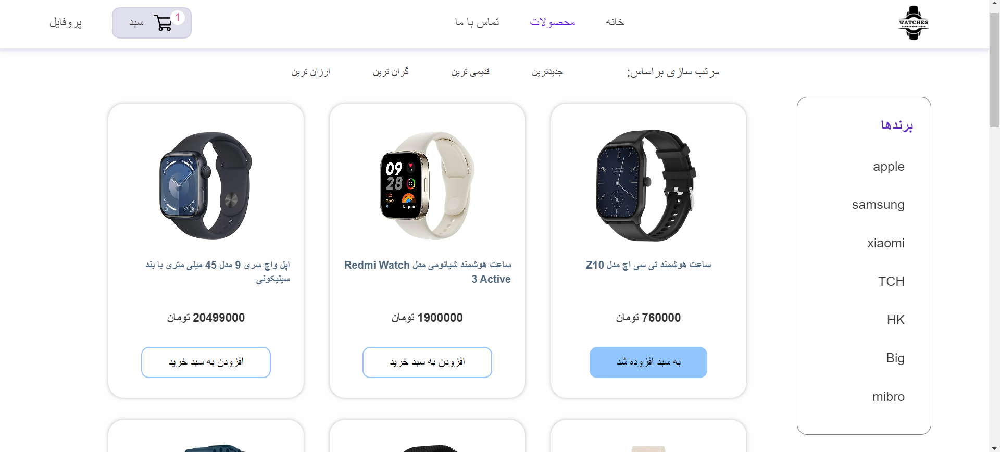
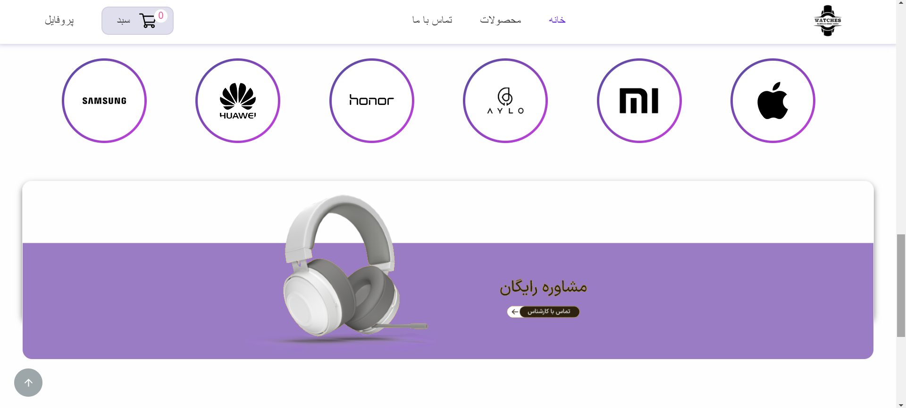
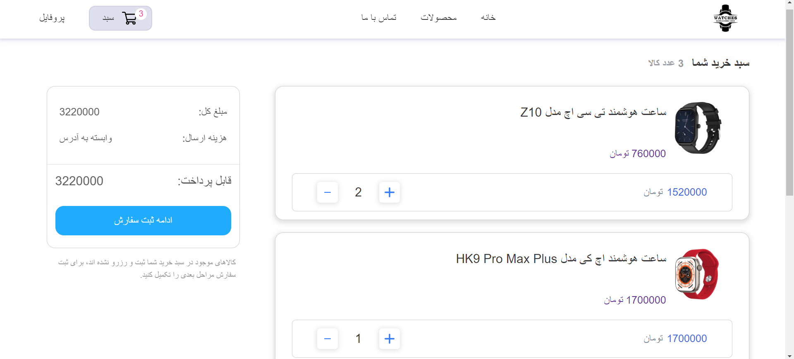

# Shopping Website

The Shopping Cart is a simple store web application made with React.js Framework. It demonstrates the basic functionality of a shopping cart, allowing users to add products, adjust quantities, and calculate the total price.


## Demo

You can access the live application at [Online Demo Store](https://zahrakhoshdel.github.io/react-shop/).


## Features

- Home
- Products (List of products)
- Product details
- Product category
- Cart management
- Login / Register

## Screenshots

<details>
<summary>See ScreenShots</summary>

  
  
  






</details>


## Run Locally

Clone the project

```bash
  git clone https://github.com/zahrakhoshdel/react-shop.git
```

Go to the project directory

```bash
  cd react-shop
```

Install dependencies

```bash
  npm install
```

Start the server

```bash
  npm start
```


## Tech Stack

- [React](https://reactjs.org/)
- [Redux](https://redux.js.org/)
- [Redux Toolkit](https://redux-toolkit.js.org/)
- [React Router](https://reactrouter.com/)


## Feedback

If you have any feedback, please reach out to me [linkedIn](https://www.linkedin.com/in/zahrakhoshdel/) or [email](mailto:imzahrakhoshdel@gmail.com)
